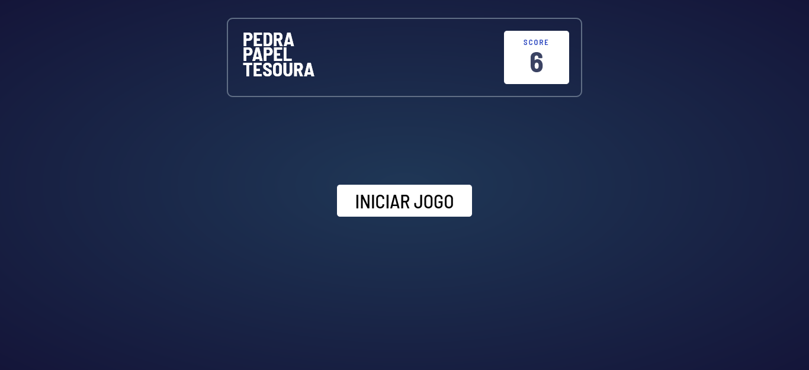
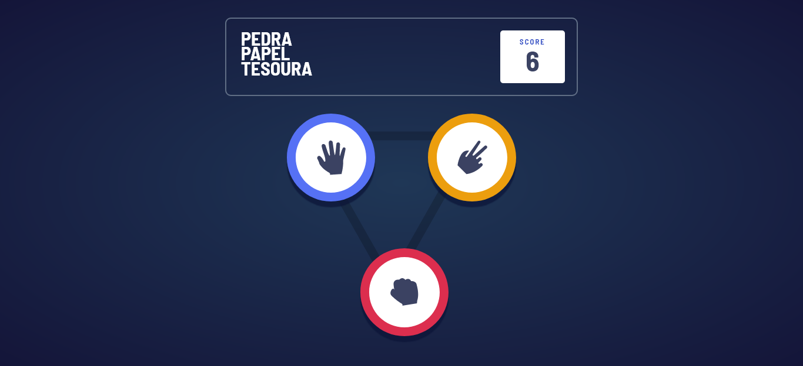
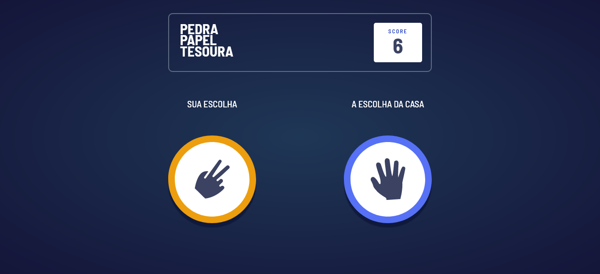
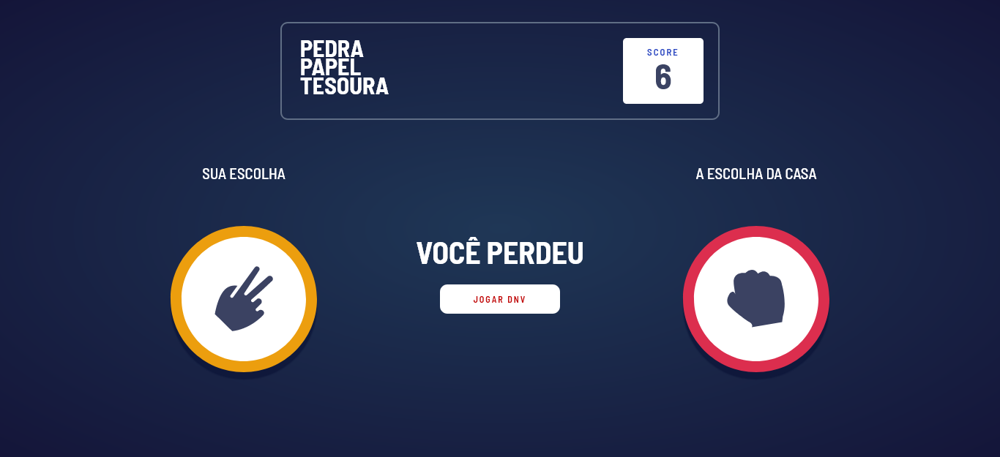

# Frontend Mentor - Rock, Paper, Scissors solution
This is a solution to the [Rock, Paper, Scissors challenge on Frontend Mentor](https://www.frontendmentor.io/challenges/rock-paper-scissors-game-pTgwgvgH). Frontend Mentor challenges help you improve your coding skills by building realistic projects. 

## Table of contents

- [Visão Geral](#overview)
  - [O desafio](#the-challenge)
  - [Imagens](#screenshot)
  - [Links](#links)
- [Meu Processo](#my-process)
  - [Feito com](#built-with)
- [Author](#author)

## Visão Geral

Uma aplicação web construida inteiramente com javascript puro, a aplicação simula o jogo pedra, papel e tesoura
onde o usuário é capaz de escolher uma das três opções e jogar contra o computador.

### O desafio

Usuários deverão ser capaz de:

- Visualizar a página de escolha em qualquer largura de tela
- Jogar pedra, papel e tesoura contra o computador
- Manter a pontuação mesmo após reiniciar a página _(optional)_

### Imagens

### Links

- Live Site URL: [Veja a aplicação aqui](patrick-ddeus.github.io/pedra-papel-tesoura)

## Meu Processo

### Feito com

- Semantic HTML5 markup
- CSS custom properties
- JavaScript Vanilla

## Author

- Website - [patric-ddeus](patrick-ddeus.github.io)
